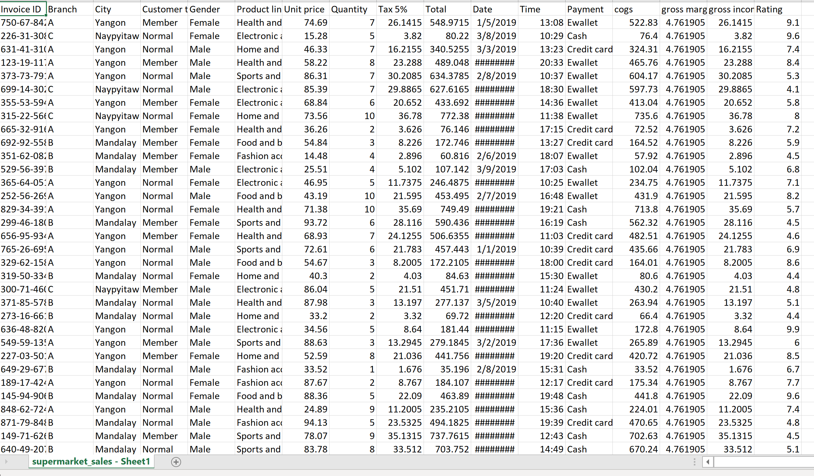
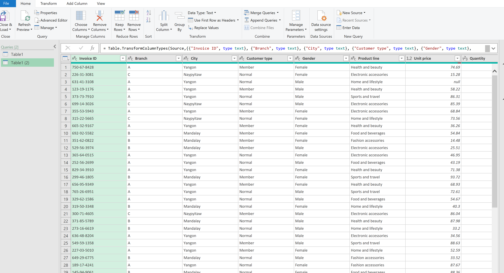
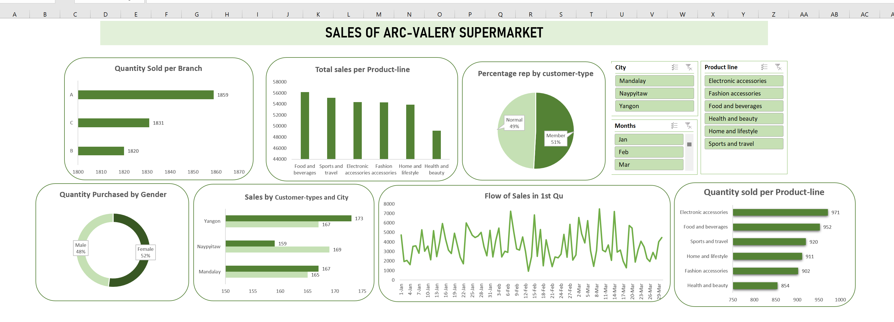

# Arc-Vallery Store Analysis

--- 
## INTRODUCTION 

This is a Microsoft Excel project on sales analysis of an imaginary store called **Arc-Vallery supermarket**.
The project is to analyze and derive insights to answer crucal business questionsand help the store make the dta driven decisions.
**_Disclaimer_** : _All datasets and reports do not represent any company, store, institution or country , but just a dummy dataset to demonstrate capabilities of Excel._

## Problem Statement: 

Problem Statement
1. Which branch sold the most,
2. which Product/product line finishes in stores before restocking,
3. Highest valued product line,
4. Which State has the highest sales and why?
5. What is the average unit-price of products.

## Skills/Concepts demonstrated:

The following Ms.Excel tools were incorporated:

- Data cleaning, 
- Sorting/arrangement,
- Power-Query,
- Pivot tables/Charts,
- Slicers, 
- Dashboard.

## Data Cleaning:

Using data cleaning and formartting to change and make necessary cleaning of the dataset to prepare it for proper analysis. 

---

Adjusted model  
We have 20 columns that shows day to day cativities in the supermarket.

---

## Visualization:
This Dashboard indicate and shows the main points but are not limited to the problem stated above, also denoting the sales over the First quarter of the year. This also give insights on the chart that fridat is most productive day of the week.

---

## Features
- The slicers on products, months and cities shows the interactiveness of the dashboard making changes on every charts,
- This indicate and display informations on the particualar charts referred to.

## Analysis:

### Customer History:
All stores has 13,045 customers in total of which 49% are normal customers and 51% members.

### Product Catalog:
There are 8 productline in the stores but the highest sold 6 are represented on the dashboard.
Also to note that Food and beverages has the hughest sales.

### Transaction History:
There were 1.9M orders in total over the first quarter of the year.

### Store: 
There are 3 stores/branches currently running and Store A has the highest sales. 

## Conclusion and Recommendations:
The first 5 productline to finish are the ones with the highest sales
The city with highest sales Yangon.
Branch A is more on sales than other stores.

#Recommendation: 
The first 5 productline should be restock as soon as possible based on weekly sales so store won't run out of the products,
Both Yangon city and Branch (A) should be paid more attention to for redistribution
Other stores/branches should focus more on marketing and customer acquisition.
